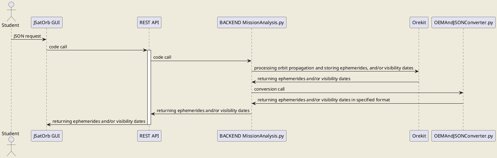

# JSatOrb project: Mission Analysis

This module uses Orekit to process satellites propagation and visibility calculations related to ground stations.  
It is mainly used for the generation of OEM files through the FileGenerator class in the ../jsatorb-common/VTS folder. [The corresponding documentation is here](../jsatorb-common/VTS/README.md).  

The central body can be chosen in the list provided by Orekit ([see this document](https://www.orekit.org/site-orekit-10.1/apidocs/org/orekit/bodies/CelestialBodyFactory.html)).  

The satellite coordinates in the request and in the response are expressed in the EME2000 inertial frame for Earth, and in the inertial frame associated with the central body for other central bodies as defined by Orekit (celestial body provided by `CelestialBodyFactory` class ([see this document](https://www.orekit.org/site-orekit-10.1/apidocs/org/orekit/bodies/CelestialBodyFactory.html)) and inertial frame provided by `getInertiallyOrientedFrame` ([see this document](https://www.orekit.org/site-orekit-10.1/apidocs/org/orekit/bodies/CelestialBody.html#getInertiallyOrientedFrame--)).  

For Keplerian and Cartesian satellites, the propagator is an analytical Keplerian propagator ([see this document](https://www.orekit.org/site-orekit-10.1/apidocs/org/orekit/bodies/CelestialBodyFactory.html)).  
For TLE satellites, the propagator is the Orekit propagator dedicated to TLEs ([see this document](https://www.orekit.org/site-orekit-10.1/apidocs/org/orekit/propagation/analytical/tle/TLEPropagator.html)).  

Since TLEs specify a date, the actual initial date is the latest date between the chosen initial date and all TLE dates.

## Prerequisites

- Python3.7
- A specific Python environment (named JSatOrbEnv) containing the following packages (installed through the conda-forge channel):
    - Orekit 10.2 (embedding hipparchus),
    - jinja2,
    - and bottle.


## Launch the service

This module is accessible through the JSatOrb centralized REST API which can be launched using the following commands:

Go into the REST API folder
```
cd jsatorb-rest-api
```
Activate the conda/python environment
```
conda activate JSatOrbEnv
```
Run the REST API
```
python src/JSatOrbREST.py
```
By default the service is running on **port 8000**.


## Request and Response Examples

Examples of OEM file generation (main purpose of this code) can be found in [the document here](../jsatorb-common/test-rest/fileGenerator-request.http), through the `FileGenerator.py` class.  
It can also be used to compute visibilities, even though they can also be computed in the ../jsatorb-common/MEM folder.


### Visibility Request Example

Route : /propagation/visibility', POST method
```json
{
  "header": {
    "timeStart": "2011-12-01T16:43:45",
    "timeEnd": "2011-12-02T16:43:45",
    "step": "60"
  },
  "satellites": [
    {"name": "Sat",
    "type": "keplerian",
    "sma": 6801682.16,
    "ecc": 0.0012566,
    "inc": 52.03041,
    "pa": 128.74852,
    "raan": 72.67830,
    "meanAnomaly": 67.79703
    }
  ],
  "groundStations": [
      {"name": "TLS",
      "latitude": "43.5",
      "longitude": "1.5",
      "altitude": "100",
      "elevation": "5.0"
      }
  ]
}
```

### Visibility Response Example

Route : /propagation/visibility', POST method
```json
{
  "TLS": {
    "Sat": [
      {
        "startDate": "2011-12-02T01:20:45.000",
        "startAz": 162.47910115367816,
        "passing": false,
        "endDate": "2011-12-02T01:25:45.000",
        "endAz": 91.12912056255888
      },
      {
        "startDate": "2011-12-02T02:55:45.000",
        "startAz": 227.86239040514803,
        "passing": false,
        "endDate": "2011-12-02T03:03:45.000",
        "endAz": 59.41780052967108
      },
      {
        "startDate": "2011-12-02T04:32:45.000",
        "startAz": 275.47498054983356,
        "passing": false,
        "endDate": "2011-12-02T04:40:45.000",
        "endAz": 51.51937331088964
      },
      {
        "startDate": "2011-12-02T06:10:45.000",
        "startAz": 305.39802356627996,
        "passing": false,
        "endDate": "2011-12-02T06:18:45.000",
        "endAz": 67.11220899606028
      },
      {
        "startDate": "2011-12-02T07:47:45.000",
        "startAz": 309.57927845815976,
        "passing": false,
        "endDate": "2011-12-02T07:56:45.000",
        "endAz": 98.90530554801903
      },
      {
        "startDate": "2011-12-02T09:24:45.000",
        "startAz": 294.857556791552,
        "passing": false,
        "endDate": "2011-12-02T09:33:45.000",
        "endAz": 141.97263349973483
      }
    ]
  }
}
```

## Module's sequence diagram



``` 
JSatOrb client can be the Web GUI or a batch client.
The REST API is the centralized REST API which code is in the jsatorb-rest-apî/JSatOrbREST.py Python module.
The back-end code is in the jsatorb-visibility-service/src Python folder.
```
